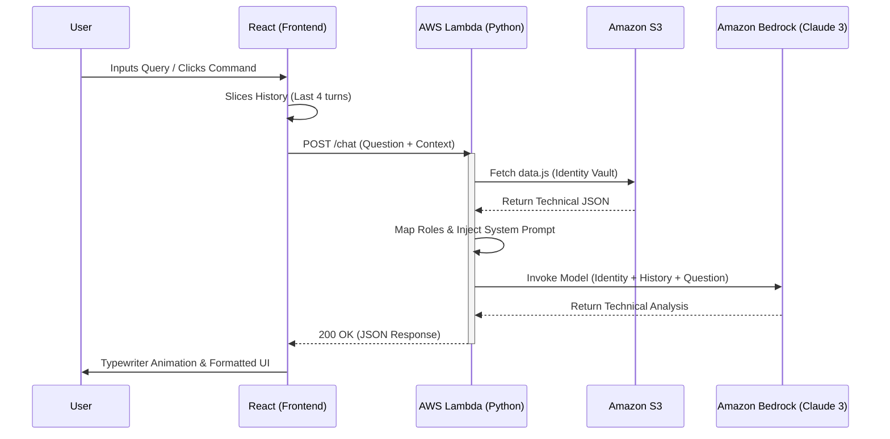

# 🤖 IS_ARCHITECT_v1.0 (AI Terminal)

A serverless, context-aware AI Terminal built with **React** and **AWS Bedrock**. This isn't just a chat window—it’s a custom **Retrieval-Augmented Generation (RAG)** pipeline that queries my career history stored securely in AWS.

## 🏗️ System Architecture

The following diagram visualizes the request lifecycle, from the UI trigger to the LLM processing and back.

## 🛠️ Technical Deep-Dive

### 1. Rolling Conversation Memory
To maintain a stateful dialogue in a stateless serverless environment, the frontend manages a **"rolling context window."** By sending the last 4 exchanges with every request, the AI can resolve pronouns (e.g., *"Tell me more about it"*) without the latency or cost of a dedicated database like DynamoDB.

### 2. Identity Injection (RAG)
Instead of hardcoding my bio into the LLM prompt, the system performs a lightweight **Retrieval-Augmented Generation (RAG)**. The Lambda fetches a centralized `data.js` object from **Amazon S3** at runtime. This ensures the AI always has the most up-to-date information regarding my projects and skill set without retraining the model.

## 🔒 Security
* **PII Masking:** Strict system prompts prevent the AI from revealing internal AWS Account IDs, S3 bucket names, or private configuration parameters.
* **CORS Policy:** Restrictive headers ensure only my authorized frontend domain can uplink to the Lambda, preventing unauthorized API usage.
* **Response Validation:** Built-in safety guards in the React layer handle empty or failed payloads gracefully, ensuring the UI remains stable during network interruptions.
