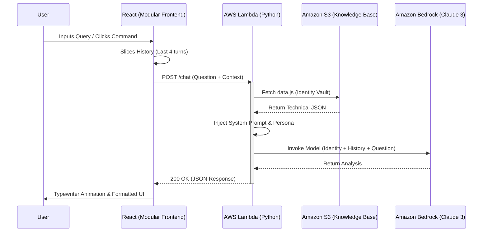
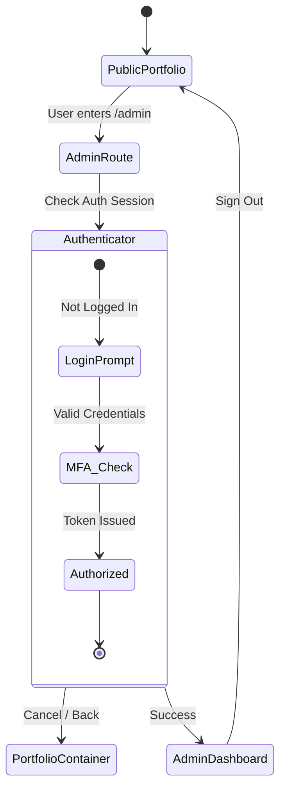

# 🤖 IS_ARCHITECT_v1.0 (AI Terminal & Admin Nexus)

A serverless, context-aware AI Terminal and Administrative Control Center. This isn't just a chat window—it’s a custom **Retrieval-Augmented Generation (RAG)** pipeline that queries my technical history stored securely in the AWS cloud.

---

## 🛠️ Tech Stack

| Layer | Technology | Purpose |
| :--- | :--- | :--- |
| **Frontend** | React 18, Vite, Framer Motion | High-performance UI & Animations |
| **Styling** | Tailwind CSS, Lucide | Technical "Nexus" Aesthetic |
| **Auth** | AWS Amplify (Cognito) | Secure Admin access via /admin |
| **AI/LLM** | Amazon Bedrock (Claude 3) | Contextual Reasoning & Analysis |
| **Serverless** | AWS Lambda, S3 | Ephemeral API & Knowledge Storage |

## 🏗️ System Architecture

### 1. AI Reasoning Lifecycle (RAG)
The following visualization shows how the frontend bridges the gap between static data and LLM reasoning.

### 2. Admin Authentication Flow
The `/admin` route is guarded by **AWS Cognito**. Unauthorized users are redirected to the public portfolio, while authenticated admins gain access to the dashboard.

## 🔒 Security & Optimization
* **Identity Vault:** Data is fetched from **Amazon S3** at runtime, ensuring the AI persona is always current without code redeploys.
* **Environment Safety:** All AWS Resource IDs are handled via Vite environment variables (`.env`).
* **PII Masking:** Strict system prompts prevent the AI from revealing internal AWS metadata.

## 🔐 Admin Preview (Internal Access Only)

Since the **Nexus Command Center** is restricted to administrator access via AWS Cognito, the following preview demonstrates the internal system monitoring and project management interface.

### Dashboard Overview
The dashboard provides a real-time "Command & Control" aesthetic, featuring:
* **Global Telemetry**: Traffic flow analysis for AI node requests.
* **Project Status**: Live monitoring of "CyberIntel" and "CloudSentry" modules.
* **System Termination**: Emergency protocol controls for serverless endpoints.

## 🧐 Why an Admin Dashboard?

While this site appears as a static personal portfolio to the public, it is powered by a **dynamic serverless backend**. I built the **Nexus Command** interface to solve two specific challenges:

1. **Live Content Management**: Instead of hardcoding project details, I can update my "Identity Vault" (S3) and tech stack in real-time without redeploying the entire frontend.
2. **Infrastructure Monitoring**: It allows me to monitor AI API usage and "Terminate" Lambda nodes if I detect unusual traffic or cost spikes, acting as a personal **Cloud Operations** center.
