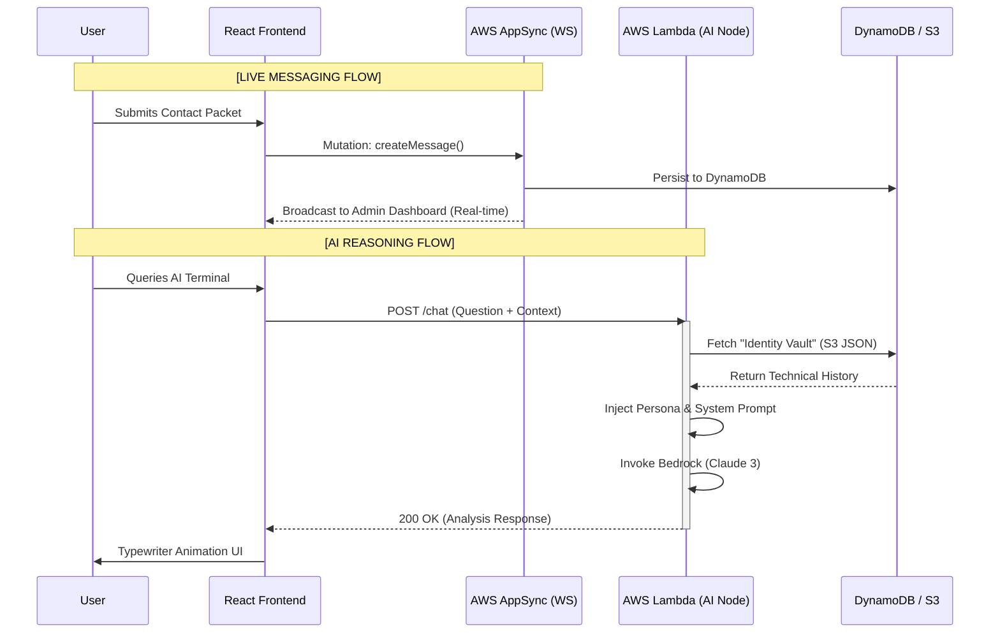
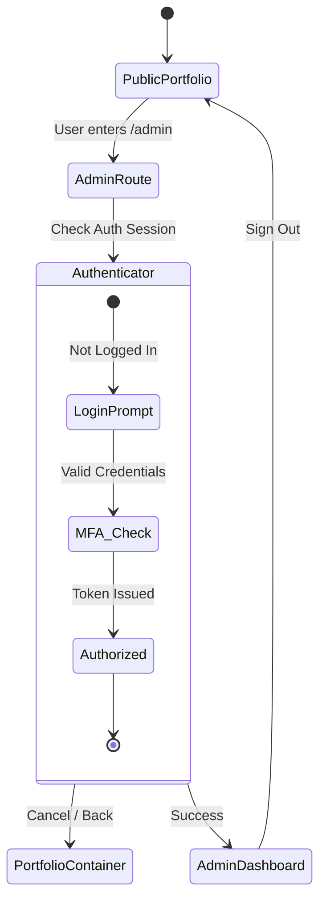
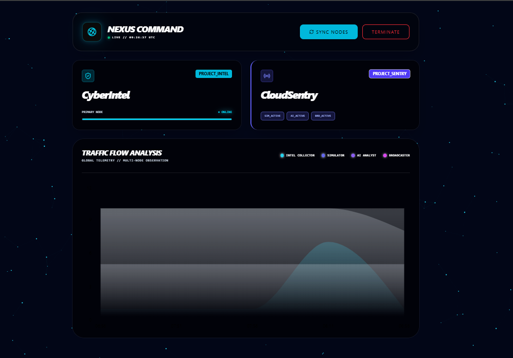

# Personal Intelligence & Portfolio System

A high-performance personal ecosystem built to showcase technical prototypes and professional experience. 

### 💡 The "Boredom" Disclosure
This project is a product of **intentional over-engineering**. While a standard portfolio could be a static HTML page, I was curious about the limits of serverless real-time synchronization. I built this because I wanted to learn how to manage a global state across a distributed AWS architecture while maintaining a high-fidelity, motion-heavy UI.

---

## 🛠️ Tech Stack

| Layer | Technology | Purpose |
| :--- | :--- | :--- |
| **Frontend** | React 18, Vite, Framer Motion | High-performance UI & Animations |
| **Styling** | Tailwind CSS, Tremor | Technical "Nexus" Aesthetic & Analytics |
| **Real-Time** | AWS AppSync (GraphQL) | WebSocket-driven Live Message Uplink |
| **Auth** | AWS Amplify (Cognito) | Secure Admin access via /admin |
| **AI/LLM** | Amazon Bedrock (Claude 3) | Contextual Reasoning (Phase 4) |
| **Database** | DynamoDB & S3 | Intelligence Storage & Identity Vault |

## 🏗️ System Architecture

### 1. The Intelligence Pipeline (RAG & Live Messaging)
The following visualization shows how the Nexus bridges the gap between static data, real-time user input, and LLM reasoning.

### 2. Admin Authentication Flow
The `/admin` route is guarded by **AWS Cognito**. Unauthorized users are redirected to the public portfolio, while authenticated admins gain access to the dashboard.

## 🔒 Security & Optimization
* **Identity Vault:** Data is fetched from **Amazon S3** at runtime, ensuring the AI persona is always current without code redeploys.
* **Environment Safety:** All AWS Resource IDs are handled via Vite environment variables (`.env`).
* **PII Masking:** Strict system prompts prevent the AI from revealing internal AWS metadata.

## 🔐 Admin Preview (Internal Access Only)

Since the **Nexus Command Center** is restricted to administrator access via AWS Cognito, the following preview demonstrates the internal system monitoring and project management interface.

### Dashboard Overview
The dashboard provides a real-time "Command & Control" aesthetic, featuring:
* **Global Telemetry**: Traffic flow analysis for AI node requests.
* **Project Status**: Live monitoring of "CyberIntel" and "CloudSentry" modules.
* **System Termination**: Emergency protocol controls for serverless endpoints.

## 🔒 Security & Operations
* **Live Message Uplink:** Uses GraphQL Subscriptions to push data to the admin without browser refreshes.
* **Identity Vault:** AI persona data is fetched from **Amazon S3** at runtime, allowing for instant updates without code redeploys.
* **PII Masking:** Strict system prompts prevent the AI from revealing internal AWS metadata or sensitive project logs.

## 🧐 Why the Over-Engineering?

I built the **Nexus Command** interface to solve three specific challenges:
1. **Real-Time Interaction**: Mastering WebSockets via AppSync to see visitor activity as it happens.
2. **Infrastructure Monitoring**: Monitoring AI API usage and the ability to "Terminate" Lambda nodes if I detect unusual traffic spikes.
3. **Content Agility**: Updating my "Identity Vault" (S3) in real-time to change how the AI represents my career history without a full CI/CD trigger.
